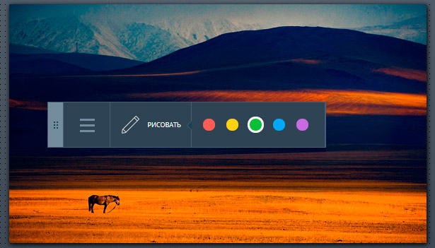
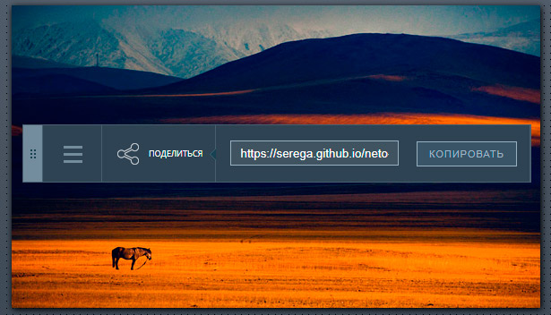

Дипломный проект курса «JavaScript в браузере»
===

В рамках дипломного проекта вам необходимо реализовать клиентскую часть сервиса, позволяющего рецензировать изображения.

Сервис предоставляет пользователям следующие возможности:
- загружать изображения;
- добавлять комментарии к конкретной части изображения;
- рисовать поверх изображения.

А также сервис наделен элементами совместной работы:
- загруженное изображение имеет уникальную ссылку, которой можно поделиться;
- все пользователи, просматривающие изображение, уведомляются о новых комментариях к нему;
- все пользователи, просматривающие изображение, в режиме рисования видят, что рисуют другие пользователи.

## Интерфейс

Приложение имет два состояния:
- Публикация (_состояние по умолчанию_):


- Рецензирование:


Также приложение имеет два компонента:
- Холст;
- Плавающее меню.

### Публикация

Этот режим открывается по умолчанию при открытии интерфейса: 


В нём доступна всего одна функция: выбор изображения и его публикация на сервере. Изображение можно выбрать двумя способами:
1. Кликнуть на поле «Загрузить новое», после чего откроется стандартный диалог выбора файла. Выбор ограничен только JPG и PNG изображениями.
2. Перетащить файл изображения и бросить на холст. Если брошена не картинка, либо картинка в другом формате (не JPG и PNG), должно появиться сообщение об ошибке.

В обоих случаях, сразу после успешного выбора изображения, оно публикуется на сервере. Если при публикации возникает ошибка, то необходимо сообщить о ней пользователю. При этом у пользователя остаётся возможность попробовать загрузить выбранное изображение повторно, либо выбрать другое изображение.

В случае успеха интерфейс переходит в состояние **Рецензирование**.

### Рецензирование

Этот режим открывается после успешной загрузки изображения:


В это состояние возможно попасть двумя способами:
1. После успешной публикации изображения (_описано в режиме Публикация_).
2. При переходе по ссылке с идентификатором (_будет описано ниже_).

В этом состоянии доступно три режима:
1. Режим **Комментирование**:
Данный режим имеет два состояния:

- По умолчанию, с отображаемыми маркерами комментариев;


Где по клику на каждый маркер открывается окно с комментарием / цепочкой комментариев и формой для отправки нового комментария:


- Со скрытыми комментариями:


2. Режим **Рисование**:



Где доступны два инструмента:

- Перо для рукописного ввода:


Толщина пера постоянна (`4px`), также пользователю доступен выбор одного из пяти цветов: красный (`#ea5d56`), жёлтый (`#f3d135`), зелёный (`#6cbe47`), синий (`#53a7f5`) и фиолетовый (`#b36ade`).

- Ластик.


3. Режим **Поделиться**:



При переходе из состояния публикации сразу открывается режим **Поделиться**. При переходе по ссылке с идентификатором открывается режим **Комментирование**. 

Для переключения между режимами доступно плавающее меню, открывающееся по клику на поле «бургер-меню» . Переключение осуществляется следующим образом:


При переключении режимов также есть возможность вернуться в состояние **Публикации**.

## Взаимодействие с сервером

Для взаимодействии с серверной частью приложения вам доступно REST API по адресу:

https://neto-api.herokuapp.com

### Добавление изображения

`POST /pic` — позволяет опубликовать на сервере новое изображение.

Формат данных при отправке `multipart/form-data`. Поля:

- `title` — название изображения, _строка_
- `image` - изображение, _файл_

В ответ приходит либо сообщение об ошибке, либо JSON-объект с данными о изображении. Например:
```json
{
  "id": "aba23fc0-1008-11e8-b8b2-2b0fbff0de7d",
  "title": "Макет дизайна",
  "url": "https://storage.googleapis.com/neto-api.appspot.com/pic/aba23fc0-1008-11e8-b8b2-2b0fbff0de7d/bMFAlDwf9AI.jpg",
  "timestamp": 1518449006013
}
```

Тут:
- `id` — идентификатор изображения на сервере, _строка_;
- `title` — название изображения, которое передано при создании, _строка_;
- `url` — URL-адрес изображения, по которому оно доступно в сети, _строка_;
- `timestamp` — время публикации изображения, _число_.

### Получение информации об изображении

`GET /pic/${id}` — получить информацию об изображении в JSON-формате. Тут `${id}` — идентификатор изображения на сервере.

В ответ приходит либо сообщение об ошибке, либо JSON-объект с данными об изображении. Например:
```json
{
  "id": "aba23fc0-1008-11e8-b8b2-2b0fbff0de7d",
  "title": "Макет дизайна",
  "url": "https://storage.googleapis.com/neto-api.appspot.com/pic/aba23fc0-1008-11e8-b8b2-2b0fbff0de7d/bMFAlDwf9AI.jpg",
  "timestamp": 1518449006013,
  "comments": {
    "-L59YakIzQIO4_qiP6ws": {
      "left": 100,
      "message": "Тут мне кажется лучше подойдет розовый цвет",
      "timestamp": 1518448045157,
      "top": 65
    },
    "-L59bM_rv4fesvnQ1nts": {
      "left": 953,
      "message": "Эта картинка на коллаже слишком шумная",
      "timestamp": 1518449031562,
      "top": 480
    }
  },
}
```

Кроме полей, которые были уже описаны при создании изображения тут может быть доступно поле `comments`, которое представляет собой справочник комментариев с уникальными ключами. Каждый комментарий имеет следующие поля:
- `message` — текст комментария, _строка_.
- `left` — расстояние по горизонтальной оси X от левого края изображения, _число_;
- `top` — расстояние по вертикальной оси Y от верхнего края изображения, _число_;
- `timestamp` — время публикации комментария, _число_.

### Добавление комментария к изображению

`POST /pic/${id}/comments` — позволяет добавить комментарий к изображению с идентификатором `${id}` на сервере.

Формат данных при отправке `application/x-www-form-urlencoded`. Поля:
- `message` — текст комментария, _строка_.
- `left` — расстояние по горизонтальной оси X от левого края изображения, _число_;
- `top` — расстояние по вертикальной оси Y от верхнего края изображения, _число_.

В ответ приходит либо сообщение об ошибке, либо JSON-объект с обновленными данными об изображении (см. _Получение информации об изображении_).
